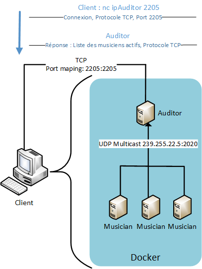
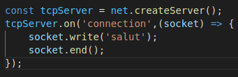
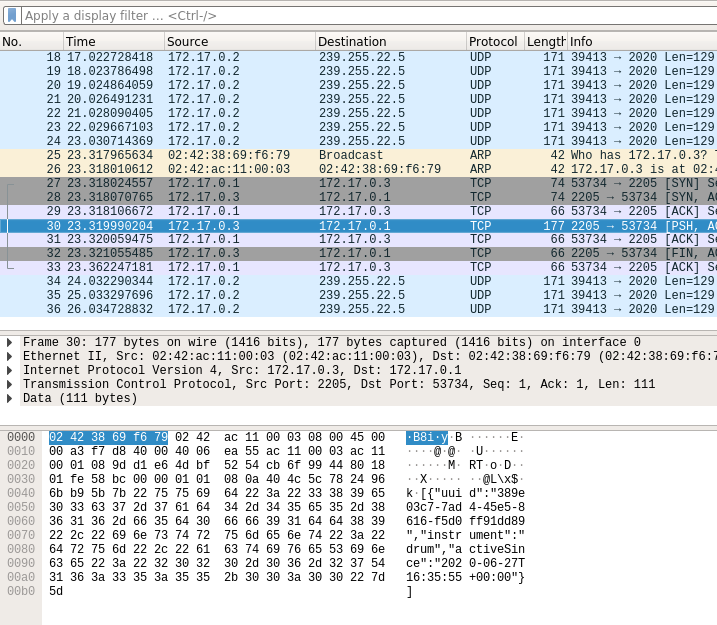

# Teaching-HEIGVD-RES-2020-Labo-Orchestra

## Admin

* **You can work in groups of 2 students**.
* It is up to you if you want to fork this repo, or if you prefer to work in a private repo. However, you have to **use exactly the same directory structure for the validation procedure to work**. 
* We expect that you will have more issues and questions than with other labs (because we have a left some questions open on purpose). Please ask your questions on Telegram / Teams, so that everyone in the class can benefit from the discussion.

## Objectives

This lab has 4 objectives:

* The first objective is to **design and implement a simple application protocol on top of UDP**. It will be very similar to the protocol presented during the lecture (where thermometers were publishing temperature events in a multicast group and where a station was listening for these events).

* The second objective is to get familiar with several tools from **the JavaScript ecosystem**. You will implement two simple **Node.js** applications. You will also have to search for and use a couple of **npm modules** (i.e. third-party libraries).

* The third objective is to continue practicing with **Docker**. You will have to create 2 Docker images (they will be very similar to the images presented in class). You will then have to run multiple containers based on these images.

* Last but not least, the fourth objective is to **work with a bit less upfront guidance**, as compared with previous labs. This time, we do not provide a complete webcast to get you started, because we want you to search for information (this is a very important skill that we will increasingly train). Don't worry, we have prepared a fairly detailed list of tasks that will put you on the right track. If you feel a bit overwhelmed at the beginning, make sure to read this document carefully and to find answers to the questions asked in the tables. You will see that the whole thing will become more and more approachable.


## Requirements

In this lab, you will **write 2 small NodeJS applications** and **package them in Docker images**:

* the first app, **Musician**, simulates someone who plays an instrument in an orchestra. When the app is started, it is assigned an instrument (piano, flute, etc.). As long as it is running, every second it will emit a sound (well... simulate the emission of a sound: we are talking about a communication protocol). Of course, the sound depends on the instrument.

* the second app, **Auditor**, simulates someone who listens to the orchestra. This application has two responsibilities. Firstly, it must listen to Musicians and keep track of **active** musicians. A musician is active if it has played a sound during the last 5 seconds. Secondly, it must make this information available to you. Concretely, this means that it should implement a very simple TCP-based protocol.


### Instruments and sounds

The following table gives you the mapping between instruments and sounds. Please **use exactly the same string values** in your code, so that validation procedures can work.

| Instrument | Sound         |
|------------|---------------|
| `piano`    | `ti-ta-ti`    |
| `trumpet`  | `pouet`       |
| `flute`    | `trulu`       |
| `violin`   | `gzi-gzi`     |
| `drum`     | `boum-boum`   |

### TCP-based protocol to be implemented by the Auditor application

* The auditor should include a TCP server and accept connection requests on port 2205.
* After accepting a connection request, the auditor must send a JSON payload containing the list of <u>active</u> musicians, with the following format (it can be a single line, without indentation):

```
[
  {
  	"uuid" : "aa7d8cb3-a15f-4f06-a0eb-b8feb6244a60",
  	"instrument" : "piano",
  	"activeSince" : "2016-04-27T05:20:50.731Z"
  },
  {
  	"uuid" : "06dbcbeb-c4c8-49ed-ac2a-cd8716cbf2d3",
  	"instrument" : "flute",
  	"activeSince" : "2016-04-27T05:39:03.211Z"
  }
]
```

### What you should be able to do at the end of the lab


You should be able to start an **Auditor** container with the following command:

```
$ docker run -d -p 2205:2205 res/auditor
```

You should be able to connect to your **Auditor** container over TCP and see that there is no active musician.

```
$ telnet IP_ADDRESS_THAT_DEPENDS_ON_YOUR_SETUP 2205
[]
```

You should then be able to start a first **Musician** container with the following command:

```
$ docker run -d res/musician piano
```

After this, you should be able to verify two points. Firstly, if you connect to the TCP interface of your **Auditor** container, you should see that there is now one active musician (you should receive a JSON array with a single element). Secondly, you should be able to use `tcpdump` to monitor the UDP datagrams generated by the **Musician** container.

You should then be able to kill the **Musician** container, wait 5 seconds and connect to the TCP interface of the **Auditor** container. You should see that there is now no active musician (empty array).

You should then be able to start several **Musician** containers with the following commands:

```
$ docker run -d res/musician piano
$ docker run -d res/musician flute
$ docker run -d res/musician flute
$ docker run -d res/musician drum
```
When you connect to the TCP interface of the **Auditor**, you should receive an array of musicians that corresponds to your commands. You should also use `tcpdump` to monitor the UDP trafic in your system.


## Task 1: design the application architecture and protocols

| #  | Topic |
| --- | --- |
|Question | How can we represent the system in an **architecture diagram**, which gives information both about the Docker containers, the communication protocols and the commands? |
| |  |
|Question | Who is going to **send UDP datagrams** and **when**? |
| | C'est le/les musicien qui envoie des datagrammes UDP dès qu'il est démarré. Avec une intervale de 1 seconde. |
|Question | Who is going to **listen for UDP datagrams** and what should happen when a datagram is received? |
| | C'est l'auditeur qui écoute pour des datagrammes UDP et lorsqu'il en reçoit, il les ajoutes à son orchestre. |
|Question | What **payload** should we put in the UDP datagrams? |
| | La payload contient l'UUID, le son, l'instument et la date/heure à laquelle le musicien a commencé à jouer. Le tout est sous forme de chaîne de charactères. |
|Question | What **data structures** do we need in the UDP sender and receiver? When will we update these data structures? When will we query these data structures? |
| | Nous avons utilisé des map (constante pour le sender et variable pour le receiver). Dans le sender, la map nous sert à stocker les sons associés aux instruments et dans le receiver, elle nous sert à stocker les musiciens qui jouent.<br />La map n'est jamais mise à jour dans le sender, contrairement à celle dans le receiver qui est mise à jour à chaque fois qu'un datagramme UDP est reçu.<br />La map du sender est interrogée au démarrage du coneneur afin de savoir quel son envoyer. La map du receiver est interrogée à chaque fois qu'une connexion TCP est effectuée sur l'adresse de multicast 239.255.22.5:2205 afin d'envoyer un tableau JSON d'objets conenant les informations des musiciens actifs. |


## Task 2: implement a "musician" Node.js application

| #  | Topic |
| ---  | --- |
|Question | In a JavaScript program, if we have an object, how can we **serialize it in JSON**? |
| | On peut serialiser un object en JSON avec `JSON.stringify( <objet ou array javascript>)`  |
|Question | What is **npm**?  |
| | *Enter your response here...*  |
|Question | What is the `npm install` command and what is the purpose of the `--save` flag?  |
| | `npm install <dépendance>` installe la dépendance, et l'ajoute dans le fichier package.JSON, `npm install` installe toutes les dépendances spécifiées dans package.JSON. Le flag `--save` sert à enregistrer la dépendance dans le package.JSON (ce qu'il fait déjà de base), il n'est donc pas très utile, et nous ne l'avons jamais utilisé dans notre labo|
|Question | How can we use the `https://www.npmjs.com/` web site?  |
| | C'est un site web qui liste des packages nodes, c'est très pratique pour trouver ce qui nous interresse (il y a des choses gratuites, d'autres non) (et pour ne pas avoir beosin de réinventer la roue), ici ,par exemple, la page pour [la dépendance moment qu'on a utilisée dans notre labo](https://www.npmjs.com/package/moment), il y a evidement une doc pour chaque package |
|Question | In JavaScript, how can we **generate a UUID** compliant with RFC4122? |
| | on peut soit le faire à la main (réinvente la roue) ou importer le package `uuid` avec `const { v4: uuidv4 } = require('uuid');` et créer un uuid avec `uuidv4()` |
|Question | In Node.js, how can we execute a function on a **periodic** basis? |
| | On utilise la methode `setInterval(<fonction_appelée>,<temps>)` qui va appeller la fonction chaque temps (en milisecondes) |
|Question | In Node.js, how can we **emit UDP datagrams**? |
| | on peut utiliser `dgram` ainsi: `const dgram = require('dgram');` et creer un "server ainsi: `const server = dgram.createSocket('udp4')`, et finalement emettre aisni: `server.send(msg, 0, msg.length, PROTOCOL_PORT, PROTOCOL_MULTICAST_ADDRESS);` , c'est ce qu'on a fait en se basant sur le thermomètre|
|Question | In Node.js, how can we **access the command line arguments**? |
| | "similairement" à `c`, on peut acceder aux arguments avec la fonction `process.argv[<2+>]` les arguments 0 et 1 sont juste nodes et le chemin du script, ils ne sont pas intéressant pour ce labo, c'est pour cela qu'on commence au 2 |


## Task 3: package the "musician" app in a Docker image

| #  | Topic |
| ---  | --- |
|Question | How do we **define and build our own Docker image**?|
| | Notre image docker est construite avec un `docker build` au niveau d'un Dockerfile, notre Dockerfile est plutot simple [dockerfile](https://github.com/alfavre/Teaching-HEIGVD-RES-2020-Labo-Orchestra/blob/master/docker/image-musician/Dockerfile) |
|Question | How can we use the `ENTRYPOINT` statement in our Dockerfile?  |
| | le mot `ENTRYPOINT` remplace le traditionel `CMD` et permet de traiter le container comme un executable (dans ce labo c'est utile pour passer des arguments lors du docker run) |
|Question | After building our Docker image, how do we use it to **run containers**?  |
| | On a simplement a lancer la commande `docker run <nom de l'image>` on peut utiliser le `-d` pour run en arrière plan, `-p` pour un port mapping, et on peut meme parfois passer des arguments (si ont a bien mis `ENTRYPOINT`) on a ecrit de nombreux scritp pour ca (ceux en `run*`)  |
|Question | How do we get the list of all **running containers**?  |
| | on fait `docker ps` pratique pour recuperer les noms des containers et les images sur lequelles ils sont basés  |
|Question | How do we **stop/kill** one running container?  |
| | on fait `docker kill <nom du container>`, le nom est celui trouvé avec `docker ps` voir question du dessus |
|Question | How can we check that our running containers are effectively sending UDP datagrams?  |
| | un moyen simple et de juste faire une capture wireshark et verifier les packets ![le groupe telegram de res est un shitshow, non seulement le ton employé par les assistants et le professeur n'est absolument pas serieux, mais cela encourage certain étudiants à se comporter comme des déchets, en particulier pour mal parler aux gens qui posent des questions sur le groupe (ce a quoi il sert), ce qui evidemment démotive d'autres étudiants à poser leurs questions, et comment oublier les messages sonores d'étudiants ivres qui n'ont pour seule réponses des danks réactions images des assistants. Aussi la blague récurrentes des assistants sur les étudiants qui vont redoubler ou comme ils disent "brûler". Enfin bref, c'est juste le type d'ambiance qu'on attend de fête au village de consanguins, pas d'un groupe telegram officiel pour un cours de la HEIG-VD. Mais j'ai vraiment l'impression que c'est moi qui me suit trompé, et que la heig, malgré tout ce qui est écrit dans le hall d'entrée, n'est qu'une énorme fète de la saucisse de fion-les-bains, 33 eme éditions.](images/task3.png)  |


## Task 4: implement an "auditor" Node.js application

| #  | Topic |
| ---  | ---  |
|Question | With Node.js, how can we listen for UDP datagrams in a multicast group? |
| | On peut s'abonner avec la commande `udpSocket.addMembership(PROTOCOL_MULTICAST_ADDRESS);` à condiiton que le tcp socket ait été initialisé.|
|Question | How can we use the `Map` built-in object introduced in ECMAScript 6 to implement a **dictionary**?  |
| | Il suffit de faire une map `const dico = new Map()` et y ajouter des "mots" ainsi: `dico.set('mot','definition')` c'est ce qu'on a fait pour la map `instrumentSoundMap` avec les instruments et leurs sons.|
|Question | How can we use the `Moment.js` npm module to help us with **date manipulations** and formatting?  |
| | on peut utiliser `moment().format()` qui retourne "maintenant" comme date dans ce format: `2020-06-27T16:35:55+00:00` de plus elle permet de nombreuses fonctions pratiques comme: `moment().diff(<valeur>,'second')` qui permettent de facilement calculer par rapport à "maintenant" et à l'unité voulue (seconde, minute, jours ...).|
|Question | When and how do we **get rid of inactive players**?  
| | on peut utiliser la methode du dessus comme ça: `if(moment().diff(moment(musician.lastTimeHeard),'second')>=INACTIVITY_TIME){` pour chaque musicien, et le retirer de la map quand cette condition est remplie |
|Question | How do I implement a **simple TCP server** in Node.js?  |
| | On utilise `net` ainsi (il faut "l'importer" avant `const net = require('net');`):  |


## Task 5: package the "auditor" app in a Docker image

| #  | Topic |
| ---  | --- |
|Question | How do we validate that the whole system works, once we have built our Docker image? |
| | On peut lancer le script validate ou on peut observer les packets dans wireshark, ou juste tester manuellement avec netcat, voila une image d'un packet tcp qui confirme bien que tout s'est passé sans problèmes |


## Constraints

Please be careful to adhere to the specifications in this document, and in particular

* the Docker image names
* the names of instruments and their sounds
* the TCP PORT number

Also, we have prepared two directories, where you should place your two `Dockerfile` with their dependent files.

Have a look at the `validate.sh` script located in the top-level directory. This script automates part of the validation process for your implementation (it will gradually be expanded with additional operations and assertions). As soon as you start creating your Docker images (i.e. creating your Dockerfiles), you should try to run it.
